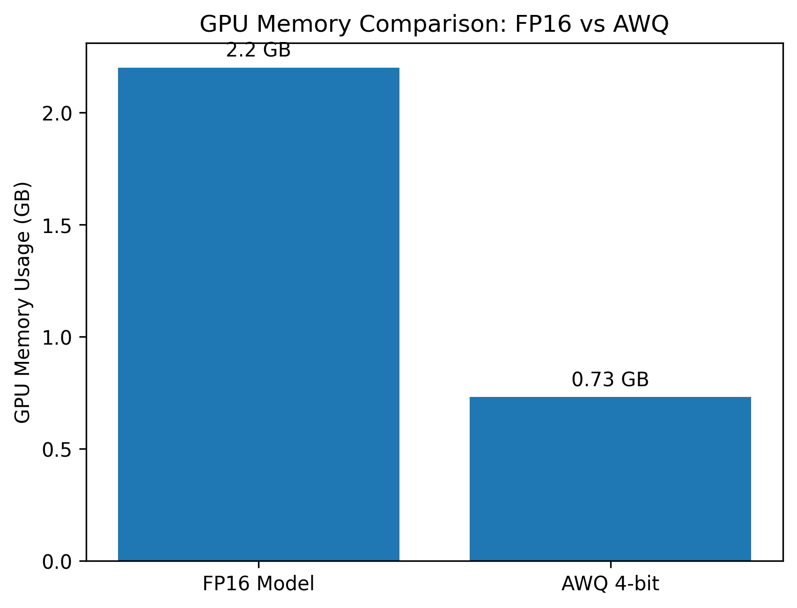
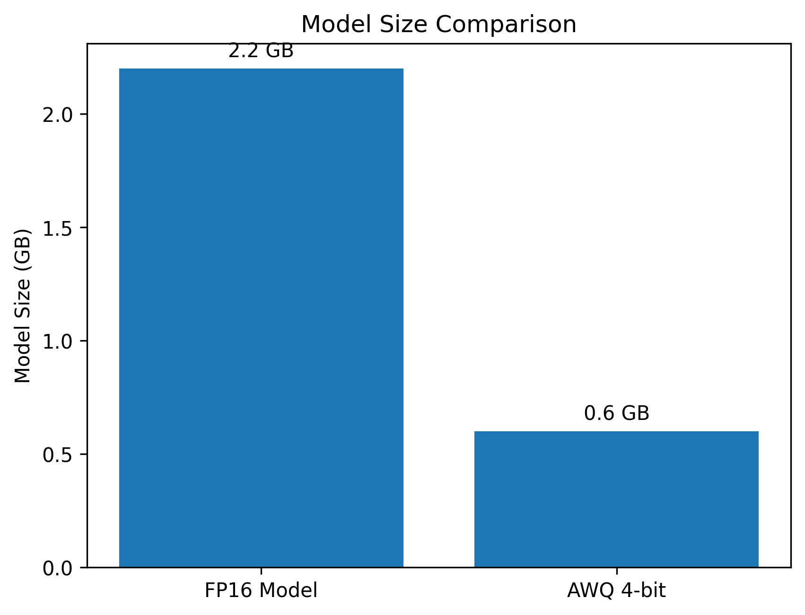

# AWQ-LLM-Quantization
# Activation-Aware Weight Quantization (AWQ)

## Overview
Large Language Models require large GPU memory and storage.
This project demonstrates Activation-Aware Weight Quantization (AWQ) to compress a language model.

## Model
TinyLlama-1.1B-Chat

## Method
4-bit Activation-Aware Weight Quantization

## Results

### GPU Memory Comparison
FP16 Model: 2.2 GB  
AWQ Model: 0.73 GB  

### Model Size Comparison
FP16 Model: 2.2 GB  
AWQ Model: 0.6 GB  

## Conclusion
AWQ significantly reduces model size and GPU memory usage.
